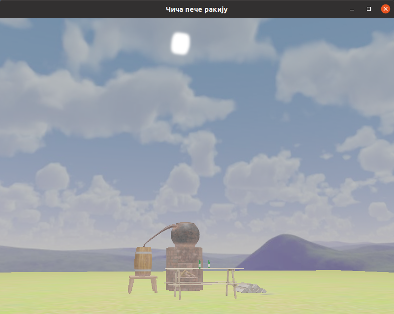

# CG Project
Faculty project from Computer Graphics.  
[Video showcasing program.](https://www.youtube.com/watch?v=sjH4vH9eUwM)

## Instructions for running the program and controls 
1. `git clone git@github.com:bandric0/RG_Projekat.git`
2. CLion -> Open -> Path to cloned repo
3. Shift+F10 for running the program
4. WASD keys - controls for moving through the scene
5. Hold LShift key - for faster movement
6. H key - turning on and off hdr
7. B key - turning on and off bloom
8. Mouse - changing view direction
9. Mouse scroll - zooming in and out

## Implemented areas
Group A : Cubemaps/Skybox  
Group B : Hdr/Bloom

## Screenshot
